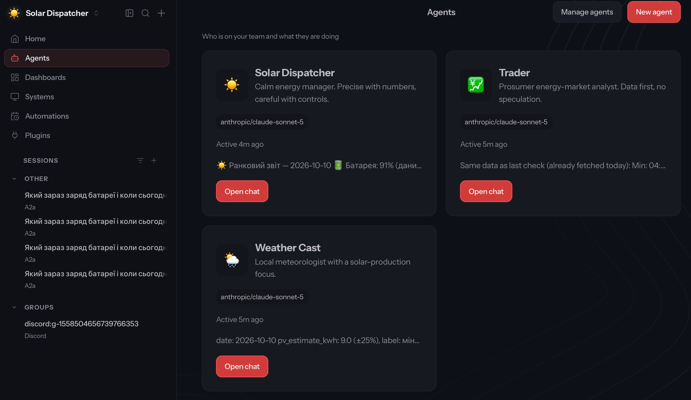
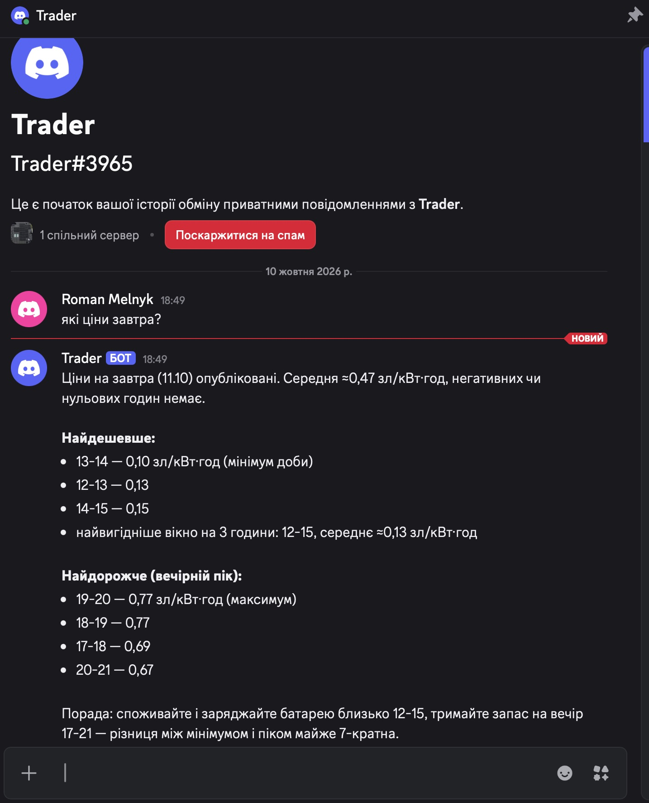
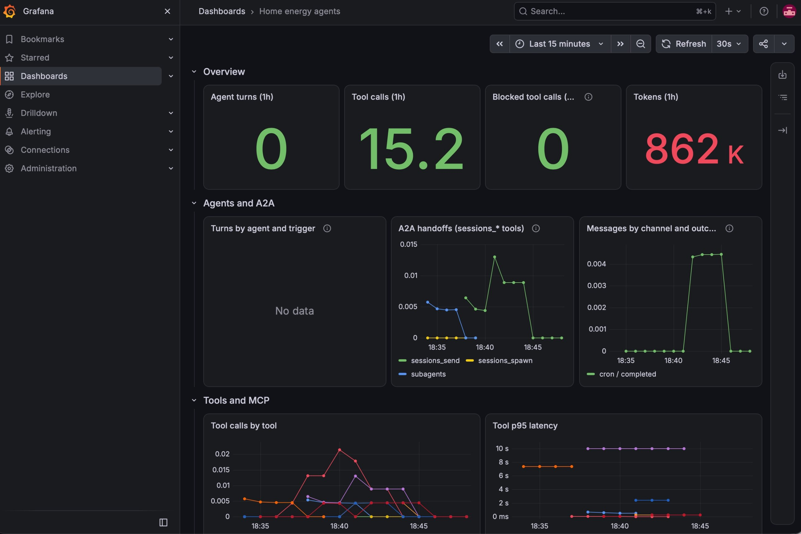

# Демо: система працює

Скріншоти зроблено 10.10.2026 близько 18:50 (Europe/Warsaw). Усе запущено
локально на Mac через `docker compose up -d` за інструкцією з
[docs/setup.md](../docs/setup.md): OpenClaw gateway, три MCP-сервери (SolaX,
Netatmo + Open-Meteo, ціни RCE) і Grafana LGTM.

## 1. Команда агентів у Control UI



Що тут видно:
- Три агенти з різними ролями: **Solar Dispatcher**, **Trader**, **Weather Cast**.
  Кожен має власну модель (`anthropic/claude-sonnet-5`), workspace, пам'ять і
  тільки свій MCP-сервер.
- Останні повідомлення агентів — результат ранкового звіту, запущеного
  вручну (`openclaw automations run <job-id>`):
  - dispatcher зібрав звіт українською: «☀️ Ранковий звіт — 2026-10-10, 🔋 Батарея: 91%…»
    (дані SolaX);
  - weather-cast відповів dispatcher-у прогнозом генерації: `pv_estimate_kwh: 9.0 (±25%)`
    (Netatmo + Open-Meteo);
  - trader відповів цінами RCE на сьогодні.
- У бічній панелі: сесії, що прийшли через протокол **A2A 1.0** від зовнішнього
  клієнта ([scripts/a2a_client.py](../scripts/a2a_client.py)), і групова сесія
  Discord-сервера.

## 2. Розмова з Trader у Discord



Користувач пише окремому боту **Trader** в особисті повідомлення: «які ціни
завтра?». Trader:
- викликає свій MCP-інструмент `rce-prices__get_prices` (дані godzinowe.pl, резерв — PSE);
- відповідає українською: на 11.10 середня ціна ≈0,47 зл/кВт·год, мінімум
  13–14 (0,10), найвигідніше 3-годинне вікно 12–15 (≈0,13), вечірній пік 19–20 (0,77);
- дає практичну пораду (skill `net-billing-advice`): споживати й заряджати
  батарею о 12–15 і зберегти заряд на 17–21.

Кожен агент має власного Discord-бота, тож до trader і weather-cast можна
звертатися напряму, а dispatcher публікує звіти в канал `#reports`.

## 3. Спостережуваність у Grafana



Дашборд [Home energy agents](../observability/) (OpenTelemetry → Grafana
otel-lgtm), останні 15 хвилин:
- **Tool calls**, **Tokens** і **Blocked tool calls = 0** — агенти працювали в
  межах своїх дозволів, жодного заблокованого виклику.
- **A2A handoffs (sessions_\* tools)** — показує виправлення, зроблене під час
  запуску. До ~18:37 dispatcher делегував через `subagents`/`sessions_spawn`
  (синя та жовта лінії). Дочірні агенти успадковували його політику
  інструментів і не мали доступу до погоди та цін. Після виправлення
  делегування йде через `sessions_send` (зелена лінія): weather-cast і trader
  працюють у власних сесіях зі своїми інструментами.
- **Messages by channel and outcome** — `cron / completed`: запланований
  ранковий звіт успішно доставлено.
- **Tool calls by tool** і **Tool p95 latency** — виклики MCP-інструментів
  SolaX, Netatmo/Open-Meteo та RCE і їхня затримка.

Панелі «Agent turns» і «Turns by agent and trigger» у цьому вікні порожні:
окремі запуски агентів видно в трейсах Tempo (`openclaw.run`).

## Відповідність вимогам домашнього завдання

| Вимога | Де видно |
| --- | --- |
| Агенти з різними ролями, моделлю та MCP, обмежений доступ | Скріншот 1: три агенти. Скріншот 3: 0 заблокованих викликів. Політика — [scripts/render_config.py](../scripts/render_config.py) |
| Постійна пам'ять | `memory/energy-log.md` і `memory/tou-proposal.md`, які dispatcher заповнив під час звіту (див. [docs/architecture.md](../docs/architecture.md)) |
| Канал комунікації | Скріншот 2: Discord, окремий бот для кожного агента |
| Співпраця агентів (A2A) | Скріншот 1: відповіді weather-cast і trader для dispatcher-а та A2A-сесії. Скріншот 3: графік `sessions_send` |
| Інструмент спостережуваності | Скріншот 3: Grafana з метриками та трейсами OpenTelemetry |

## Як відтворити

```bash
docker compose up -d
scripts/setup_automations.sh
docker compose exec openclaw openclaw automations list
docker compose exec openclaw openclaw automations run <morning-job-id>
```

Grafana: http://127.0.0.1:3000 → Dashboards → Home energy agents.
