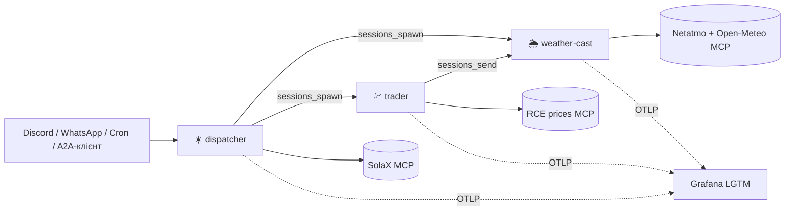

# ☀️ Домашня енергетична агентна система

Домашнє завдання до воркшопу **[Agentic System Workshop (fwdays)](https://fwdays.com/event/agentic-system-workshop)**.

## Завдання

> Створіть GitHub repo з робочою агентною системою, яка розв'язує одну вашу
> реальну задачу – наприклад, збирає матеріали та готує звіт. Можна розвинути
> налаштування з курсу; stack обираєте самостійно.
>
> У проєкті мають бути:
> 1. **Агенти.** Щонайменше два агенти з різними ролями, інструкціями та межами доступу. Підключена модель і хоча б один tool або MCP server.
> 2. **Persistent memory.** Агент зберігає інформацію та використовує її після перезапуску в новій розмові.
> 3. **Канал комунікації.** Через Telegram/Slack/WhatsApp/Discord користувач ставить задачу й отримує результат.
> 4. **Співпраця через A2A.** Сетап має декілька агентів, які можуть взаємодіяти між собою.
> 5. **Observability tool.** Dashboard або tracing tool, де видно дії агентів, tool calls, A2A-обмін, статуси та помилки.

## Яку реальну задачу розв'язує

Удома встановлені сонячні панелі з батареєю та інвертором **SolaX** і метеостанція
**Netatmo** (вулична станція, анемометр, дощомір). Електроенергія розраховується
в net-billing за погодинними цінами **RCE**. Щодня треба зрозуміти: скільки
залишилось у батареї після ночі, скільки буде сонця, коли енергія дешева чи
дорога, скільки вироблено за день.

Команда з трьох агентів робить це автоматично і **двічі на день надсилає звіт**
у Discord та/або WhatsApp, а також відповідає на запитання в чаті українською.

| Агент | Роль | Джерело даних (MCP) |
| --- | --- | --- |
| ☀️ **solar-dispatcher** (`dispatcher`) | Головний: статистика інвертора й батареї, режими роботи, ранковий і вечірній звіти, делегування | [SolaX Cloud MCP](https://github.com/mouldiwarp/solax-cloud-mcp) |
| 🌦️ **weather-cast** | Показники станції, прогноз, оцінка генерації PV | власний MCP: Netatmo + Open-Meteo |
| 💹 **trader** | Погодинні ціни RCE, найдешевші/найдорожчі години, поради щодо використання енергії | власний MCP: [godzinowe.pl](https://godzinowe.pl) API |

**Ранковий звіт (07:00):** заряд батареї після ночі та зміна за ніч, споживання
будинку вночі, погода й прогноз генерації на сьогодні, ціни на сьогодні, порада.
**Вечірній звіт (21:30):** вироблено за день, імпорт/експорт, споживання за день,
заряд батареї перед ніччю, прогноз і ціни на завтра.

## Як виконано вимоги

| # | Вимога | Реалізація |
| --- | --- | --- |
| 1 | Агенти з різними ролями та межами доступу, модель, MCP | 3 агенти OpenClaw з окремими workspace та інструкціями ([agents/](agents/)). Модель — Anthropic (налаштовується). 3 MCP-сервери ([mcp-servers/](mcp-servers/)). Кожен агент бачить **лише свій** MCP (deny `server__*`), shell/web/браузер заборонені, керування батареєю вимкнене за замовчуванням і потребує підтвердження. Деталі: [docs/architecture.md](docs/architecture.md#agents-and-access-boundaries) |
| 2 | Persistent memory | Markdown-пам'ять OpenClaw (`MEMORY.md`, `memory/*.md`) у `.local/workspaces`, переживає перезапуск. Ранковий звіт рахує нічне споживання з **вечірнього знімка, збереженого в попередньому запуску**; «запам'ятай…» зберігає вподобання |
| 3 | Канал комунікації | **Discord** (окремий бот для кожного агента) і **WhatsApp** (диспетчер). Звіти доставляються автоматично за розкладом |
| 4 | Співпраця через A2A | Усередині gateway: dispatcher → `sessions_spawn` → weather-cast/trader, trader → `sessions_send` → weather-cast; видимі handoff-и в Discord. Плюс стандартний протокол **A2A 1.0** (Agent Card + JSON-RPC) для зовнішніх агентів: [scripts/a2a_client.py](scripts/a2a_client.py) |
| 5 | Observability | OpenTelemetry → **Grafana LGTM** (Tempo, Prometheus, Loki) з готовим дашбордом: ходи агентів, tool calls (MCP), A2A-обмін, заблоковані виклики, помилки, токени. [docs/observability.md](docs/observability.md) |

## Архітектура



**Stack:** OpenClaw 2026.9.6 (gateway, агенти, пам'ять, cron, канали, A2A) ·
Python MCP-сервери (FastMCP, streamable HTTP + bearer token) · Docker Compose ·
grafana/otel-lgtm.

## Швидкий старт

```bash
git clone git@github.com:aywengo/fwdays-agents-homework.git && cd fwdays-agents-homework
python3 scripts/render_config.py init      # .env з згенерованими внутрішніми токенами
$EDITOR .env                               # SolaX, Netatmo, модель, Discord/WhatsApp
python3 scripts/netatmo_auth.py            # одноразова OAuth-авторизація Netatmo
python3 scripts/render_config.py render    # конфіг OpenClaw + workspace агентів у .local/
docker compose up -d --build
scripts/smoke_test.sh                      # перевірка без витрати токенів
scripts/setup_automations.sh               # ранковий і вечірній звіти
```

- Control UI: http://127.0.0.1:18789 · Grafana: http://127.0.0.1:3000
- Повна інструкція (англ.): [docs/setup.md](docs/setup.md)

## Секрети

Усі ключі та токени — лише в `.env` (у `.gitignore`, права 0600). У репозиторії
та в згенерованому конфігу є тільки посилання на змінні середовища. Кожен
контейнер отримує лише свої змінні. Перед комітом: `python3 scripts/check_secrets.py`.
Детально: [docs/security.md](docs/security.md).

## Сценарії для демонстрації

1. **Канал + A2A:** у Discord `@Dispatcher скільки зараз у батареї і коли сьогодні найдешевша енергія?` → диспетчер читає SolaX, делегує trader-у, відповідає українською.
2. **Межі доступу:** `@Trader який зараз заряд батареї?` → trader відповідає, що не має доступу до SolaX, і пропонує звернутися до диспетчера; у Grafana видно заблокований виклик, якщо модель спробує.
3. **Пам'ять:** `запам'ятай: мінімальний заряд батареї для мене — 25%` → перезапуск `docker compose restart openclaw` → нова розмова: `який мінімальний заряд я просив?`.
4. **Звіт:** `docker compose exec openclaw openclaw automations run <job-id>` → звіт у Discord/WhatsApp; у Grafana трейс з викликами `solax-cloud__*`, `sessions_spawn`, `netatmo-weather__*`, `rce-prices__*`.
5. **Зовнішній A2A:** `python3 scripts/a2a_client.py send "Підготуй короткий прогноз на завтра"`.

## Структура

```
agents/            інструкції агентів (AGENTS.md, SOUL.md, IDENTITY.md, TOOLS.md, шаблони пам'яті)
mcp-servers/       MCP: SolaX (обгортка над upstream), Netatmo+Open-Meteo, ціни RCE; тести
scripts/           render_config.py, netatmo_auth.py, setup_automations.sh, a2a_client.py, smoke_test.sh, check_secrets.py
observability/     дашборд Grafana
docs/              архітектура, встановлення, observability, безпека (англ.)
docker-compose.yml
```

Документація англійською, спілкування агентів з користувачем — українською.

## Подяки

- Налаштування курсу [danil-topchiy/agents-setup](https://github.com/danil-topchiy/agents-setup) — основа для OpenClaw-конфігурації та Discord-команди.
- [mouldiwarp/solax-cloud-mcp](https://github.com/mouldiwarp/solax-cloud-mcp) — MCP для SolaX Cloud.
- [godzinowe.pl](https://godzinowe.pl) — безкоштовне API цін RCE для приватного використання.
