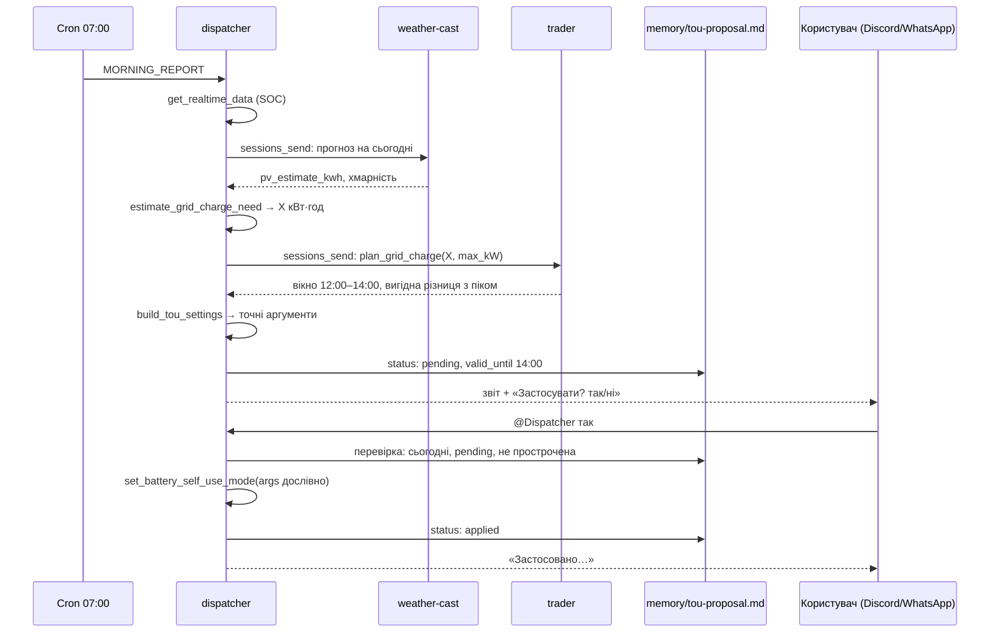

# Архітектура

```mermaid
flowchart LR
  subgraph Користувачі
    D[Discord<br/>3 боти]:::ch
    W[WhatsApp]:::ch
    X[Зовнішній A2A-клієнт<br/>scripts/a2a_client.py]:::ch
    C[Cron 07:00 / 21:30]:::ch
  end
  subgraph OpenClaw Gateway 2026.9.6
    DI[☀️ dispatcher<br/>агент за замовчуванням]
    WC[🌦️ weather-cast]
    TR[💹 trader]
    MEM[(workspace + memory/<br/>.local/workspaces)]
  end
  subgraph MCP-сервери - приватна мережа, bearer-автентифікація
    S[solax-cloud<br/>upstream mouldiwarp/solax-cloud-mcp]
    N[netatmo-weather<br/>Netatmo + Open-Meteo]
    P[rce-prices<br/>godzinowe.pl + кеш]
  end
  LGTM[Grafana LGTM<br/>Tempo / Prometheus / Loki]
  D --> DI & WC & TR
  W --> DI
  X -- A2A 1.0 JSON-RPC --> DI
  C --> DI
  DI -- sessions_send --> WC & TR
  TR -- sessions_send --> WC
  DI --> S
  WC --> N
  TR --> P
  DI & WC & TR --- MEM
  DI & WC & TR -. OTLP трейси/метрики/логи .-> LGTM
  classDef ch fill:#eef,stroke:#88a
```

## Агенти та межі доступу

| Агент | Роль | MCP-інструменти | Інші інструменти | Заборонено |
| --- | --- | --- | --- | --- |
| `dispatcher` | Точка входу, звіти, статистика SolaX та (за потреби) зміна режимів | `solax-cloud__*` | пам'ять, read/write у власному workspace, `sessions_send` | `netatmo-weather__*`, `rce-prices__*`, exec, web, browser, messaging, automation |
| `weather-cast` | Показники станції, прогноз, прогноз генерації PV | `netatmo-weather__*` | пам'ять, власний workspace, `sessions_send` | `solax-cloud__*`, `rce-prices__*`, `sessions_spawn`, `subagents` + глобальні заборони |
| `trader` | Аналіз цін RCE та поради щодо часу використання енергії | `rce-prices__*` | пам'ять, власний workspace, `sessions_send` (запити до weather-cast) | `solax-cloud__*`, `netatmo-weather__*`, `sessions_spawn`, `subagents` + глобальні заборони |

Рівні, що забезпечують межі (усе генерує `scripts/render_config.py`):

1. **Глобальна політика інструментів**: `tools.profile: minimal` плюс явний список
   `alsoAllow`; групи exec, web, browser, messaging, automation і media
   заборонені; файлові інструменти обмежені власним workspace агента.
2. **Списки заборон для кожного агента**: кожен агент забороняє MCP-сервери інших
   агентів через глоби `server__*`, тож агент не може дістатися чужого джерела
   даних, навіть якщо його про це попросять.
3. **Allowlist агент-агент**: `tools.agentToAgent.allow` містить лише трьох
   агентів; запускати субагентів може тільки dispatcher (`subagents.allowAgents`).
4. **На боці MCP-сервера**: `set_battery_self_use_mode` видаляється із сервера
   SolaX, якщо не встановлено `SOLAX_ALLOW_CONTROL=true`, і `toolFilter` в OpenClaw
   теж його приховує. Інструмент позначено `destructiveHint`, тож OpenClaw також
   вважає його дією, що потребує підтвердження. Інструменти читання мають `readOnlyHint`.
5. **Заплановані завдання** створюються з обмеженням `--tools`, яке виключає
   керування батареєю.
6. **Мережа**: MCP-сервери не мають опублікованих портів і вимагають bearer-токен
   (`MCP_INTERNAL_TOKEN`); Gateway і Grafana слухають лише на `127.0.0.1`.

## Агент-агент (A2A)

Два механізми, що доповнюють один одного:

- **Усередині Gateway**: dispatcher делегує через `sessions_send` (колега працює
  у власній сесії зі своїми інструментами, відповідь повертається в той самий хід); trader консультується з weather-cast через
  `sessions_send`. У Discord (окремий бот для кожного агента) передачі задач також
  видно як @згадки в командному каналі.
- **Стандартний протокол A2A 1.0** (`channels.a2a`): Gateway публікує Agent Card
  за адресою `/.well-known/agent-card.json` з окремим skill для кожного агента і
  приймає автентифіковані JSON-RPC-виклики `SendMessage`/`GetTask` на `/a2a/v1`.
  Зовнішні агенти (або `scripts/a2a_client.py`) можуть передати задачу команді;
  задача маршрутизується до dispatcher-а, який далі делегує всередині.

## Постійна пам'ять

Пам'ять OpenClaw — це звичайний Markdown у workspace кожного агента, змонтований
з `.local/workspaces/<agent>`, тож вона переживає перезапуск контейнерів і нові сесії:

- `MEMORY.md` — тривкі факти та вподобання («запам'ятай, мінімальний SOC 20%»),
  завантажуються на початку кожної сесії.
- `memory/energy-log.md` — вечірні та ранкові знімки SolaX від dispatcher-а.
  Ранковий звіт рахує нічне споживання та зміну заряду батареї з вечірнього знімка
  попереднього дня, тобто залежить від пам'яті, записаної в попередньому запуску.
- `memory/tou-proposal.md` — поточна пропозиція TOU (dispatcher), місток між ранковим звітом і вашим «так».
- `memory/alerts.md` — надіслані попередження по каналах (weather-cast), щоб не повторюватися.
- Місячні файли: `memory/weather-events-YYYY-MM.md` (погодні події), `memory/prices-YYYY-MM.md`
  (денні підсумки цін), доступні для пошуку через `memory_search`.
- Архіви `memory/energy-log-YYYY-MM.md`, `memory/alerts-YYYY-MM.md` і журнал
  `memory/maintenance-log.md` створює щомісячне обслуговування (скіл `memory-hygiene`):
  копія → перевірка → перезапис, тож дані не губляться, а `MEMORY.md` лишається коротким.

`render_config.py render` оновлює файли інструкцій (`AGENTS.md`, `SOUL.md`,
`IDENTITY.md`, `TOOLS.md`) з `agents/`, але ніколи не перезаписує `MEMORY.md`,
`USER.md` чи `memory/`.

## Звіти та автоматизації

| Завдання | Агент | Розклад за замовчуванням | Зміст |
| --- | --- | --- | --- |
| Ранковий звіт | dispatcher | `0 7 * * *` Europe/Warsaw | Заряд батареї після ночі, споживання вночі, погода та прогноз генерації на сьогодні, попередження, ціни на сьогодні, пропозиція заряду з мережі й запитання, чи застосувати TOU |
| Вечірній звіт | dispatcher | `30 21 * * *` | Вироблено за день, імпорт/експорт з мережі, споживання за день, заряд батареї перед ніччю, погода, попередження та ціни на завтра |
| Перевірка погоди | weather-cast | `15 6-21/3 * * *` | Лише нові або посилені попередження ⚠️/🚨 на наступні 12 год; інакше `NO_REPLY`, і OpenClaw нічого не надсилає |
| Обслуговування пам'яті | кожен агент | `30 3 1 * *` | Архівація минулих місяців журналів і стиснення `MEMORY.md`; без доставки |

Завдання виконуються в ізольованих сесіях з обмеженим набором інструментів (`--tools`)
і створюються командою `scripts/setup_automations.sh`. Звіти й перевірка погоди
створюються для кожного каналу окремо (Discord, WhatsApp), тому записи в пам'ять
ідемпотентні.

## Скіли

| Агент | Скіли |
| --- | --- |
| dispatcher | `no-ai-slop`, `uk-writing-style`, `memory-hygiene`, `energy-history-analysis` |
| weather-cast | `no-ai-slop`, `uk-writing-style`, `memory-hygiene`, `pv-forecast-reading`, `weather-alerts` |
| trader | `no-ai-slop`, `uk-writing-style`, `memory-hygiene`, `net-billing-advice` |

`no-ai-slop` — зовнішній скіл, зафіксований на коміті й перевірений sha256; решта — власні
(`skills/local/`). Кожен агент бачить лише свої скіли (allowlist). Опис кожного скіла,
коли він спрацьовує і як додати новий: [skills.md](skills.md).

## Пропозиція заряду та налаштування TOU

Щоранку dispatcher аналізує прогноз і ціни та пропонує, коли зарядити батарею з
мережі, а після звіту питає, чи застосувати ці налаштування TOU до інвертора.



**Розрахунок — детермінований код, а не модель** (покрито тестами в
`mcp-servers/tests/test_planning.py`):

- `estimate_grid_charge_need` (сервер SolaX, лише dispatcher): скільки енергії бракуватиме
  на вечір і ніч. Вечір починається з кінця вікна генерації PV цього дня
  (`pv_window` від weather-cast, за сходом і заходом сонця), а без нього — о 17:00.
  Денна частка споживання = тривалість вікна / 24 год (у межах 10–70%), решта — увечері та
  вночі. Запас на початок вечора = зараз над `BATTERY_MIN_SOC` + PV, що ще очікується
  (`pv_remaining_kwh`), − денне споживання, в межах до `BATTERY_TARGET_SOC`. З мережі — лише нестача і лише в місце, яке PV залишить вільним.
- `plan_grid_charge` (сервер цін, лише trader): найдешевше суцільне вікно потрібної
  довжини (енергія / `BATTERY_MAX_CHARGE_KW`) від наступної повної години до кінця вікна PV
  (`latest_end_hour`, не пізніше 17:00),
  порівняне з найдорожчим вікном тієї ж довжини ввечері. Рекомендується, якщо
  ціна піку − ціна заряду / 0.9 (втрати) ≥ 0.20 zł/кВт·год, або ціна нульова/від'ємна.
- `build_tou_settings` (сервер SolaX): повний набір аргументів для вікна заряду та
  для базового режиму (self-use без заряду з мережі). Запис у інвертор
  завжди передає всі ключі, бо власні значення за замовчуванням upstream-інструмента
  небезпечні (`charge_from_grid_enable=1`, `min_soc=10`).

**Чому підтвердження йде через пам'ять.** Ранковий звіт виконується в
ізольованій сесії cron без доступу до керування. Відповідь «так» приходить у
звичайну сесію каналу, яка не бачить контексту cron. Тому пропозиція з точними
аргументами зберігається в `memory/tou-proposal.md`; dispatcher застосовує її дослівно
лише якщо вона сьогоднішня, у статусі `pending` і ще не прострочена.

Захист:
- Заплановані завдання мають `--tools` без `set_battery_self_use_mode` — cron фізично не
  може змінити інвертор.
- Підтвердження приймається лише в розмові в Discord або WhatsApp (allowlist — лише
  власник), не з A2A чи від інших агентів.
- Після `valid_until` (кінець вікна) пропозиція вважається простроченою.
- Періоди TOU у SolaX повторюються щодня, тому вечірній звіт після
  застосованого вікна пропонує повернути базові налаштування (той самий механізм так/ні).
- Без `SOLAX_ALLOW_CONTROL=true` пропозиція показується як порада для ручного
  налаштування в застосунку SolaX, без запитання.

## Джерела даних

| Джерело | Доступ | Примітки |
| --- | --- | --- |
| SolaX Developer Platform (`openapi-eu.solaxcloud.com`) | OAuth2 client credentials | Лише дані в реальному часі (без історії); денні показники беруться з лічильників `today*` і збережених знімків. Ліміт upstream — 100 викликів/хв. |
| Netatmo (`api.netatmo.com`) | OAuth2, `read_station` | Refresh-токени ротуються; поточний зберігається в томі `weather-state`. |
| Open-Meteo | без автентифікації | Прогноз для місця розташування будинку: стан погоди (код WMO), схід і захід сонця, тривалість дня, сонячні години, інсоляція, хмарність, опади по годинах, UV-індекс. Погодинні слоти від сходу до заходу, вікно генерації PV і решта генерації на сьогодні рахуються в `weather_server.py`. |
| API godzinowe.pl | без автентифікації (безкоштовно для приватного використання) | Погодинні ціни PSE RCE; відповіді кешуються по днях. |
| PSE (`api.raporty.pse.pl/api/rce-pln`) | без автентифікації | Резервне джерело тих самих цін RCE (15-хвилинні значення, сервер усереднює їх до годин), коли godzinowe.pl не має даних, повертає помилку чи 429. |
